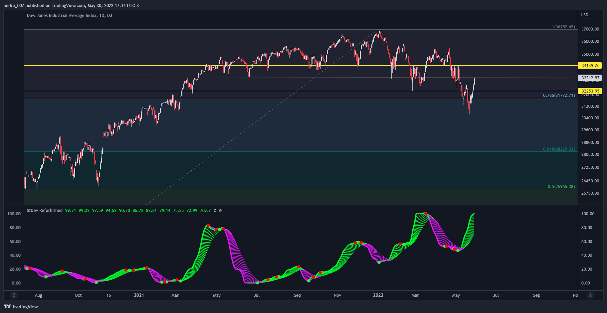

# █ Standard Deviation Refurbished

This is an indicator in PineScript (TradingView) that serves to show the standard deviation in a more improved and less trivial form.

Basically, I put the option to normalize the indicator in a range of 0 to 100.

I also put 10 moving averages of standard deviation.

In the graphic part was placed the choice of themes.

Gratitude to the author 'The_Caretaker' by the themes 'Spectrum Blue-Green-Red' and 'Spectrum Blue-Red'.

## █ Concepts

"Standard Deviation is a way to measure price volatility by relating a price range to its moving average. 

The higher the value of the indicator, the wider the spread between price and its moving average, the more volatile the instrument and the more dispersed the price bars become. 

The lower the value of the indicator, the smaller the spread between price and its moving average, the less volatile the instrument and the closer to each other the price bars become. 

Standard Deviation is used as part of other indicators such as Bollinger Bands . 

It is often used in combination with other signals and analysis techniques."

(TradingView)

## █ THANKS AND CREDITS

- TradingView (StDev and MAs)
- The_Caretaker (themes 'Spectrum Blue-Green-Red' and 'Spectrum Blue-Red')

## █ DONATIONS

- BTC: 3AK6MxX93czQraP4AFv1wKYDvPnPipgF51
- LTC: MBabKb6vedx3UsxTwMJCPPjKdLJSr6dczS
- Dash: XcmdgWfnNQeJEJhkd6pUaaQpmT3AiA98QA